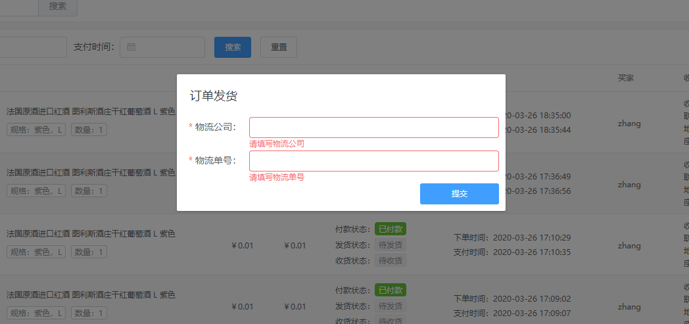
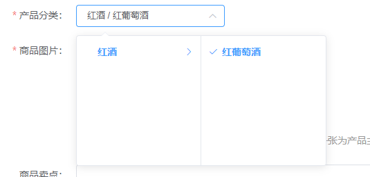
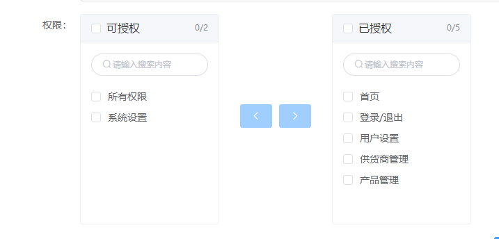
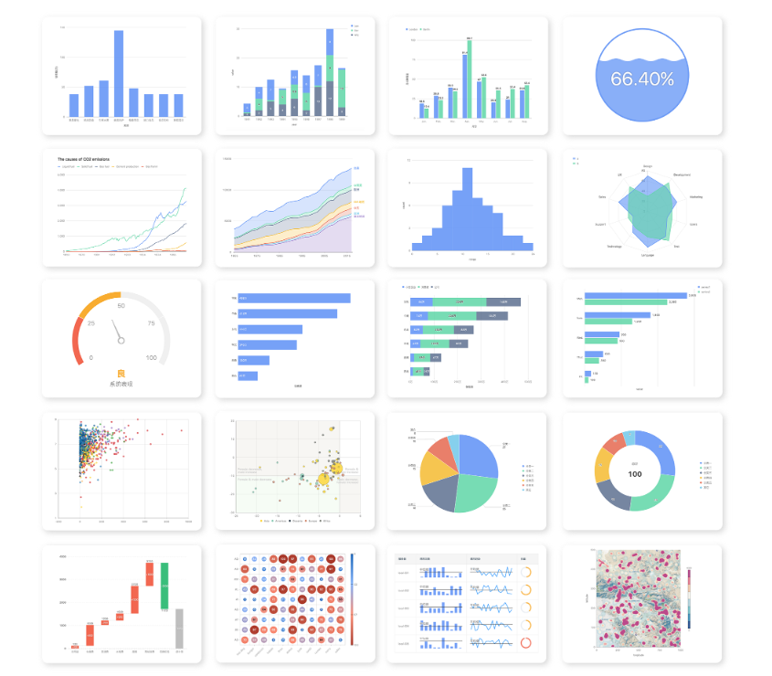
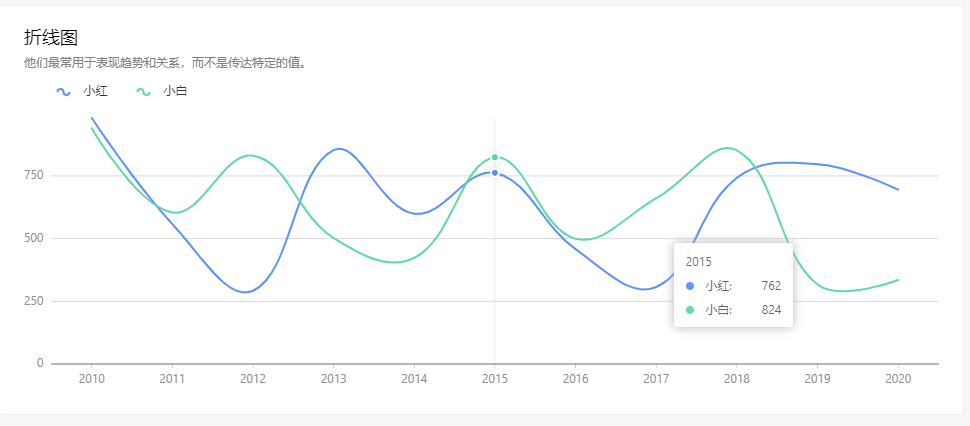
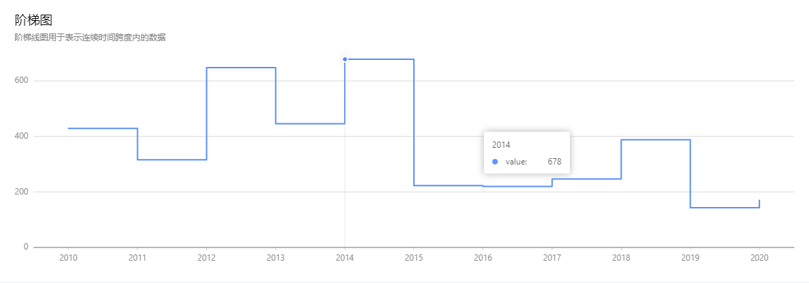
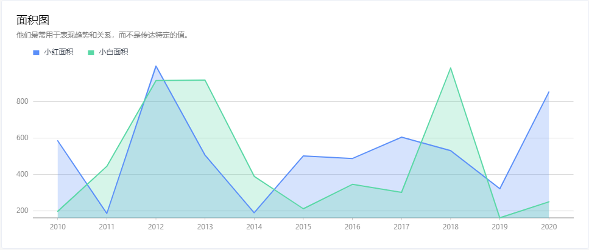
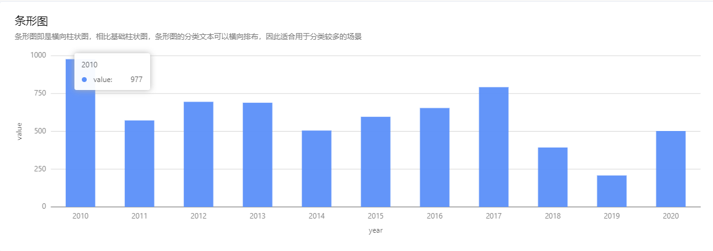

## 公共方法

每个组件都可以设置`class`和`style`

```php
className('class-1 class-2');
style(['width'=>'100px']);
```
## 基础表单

可实现简单的表单，不带模型


```php
$baseForm = new BaseForm();//实例化
$baseForm->action(route("order-express"));//设置表单提交地址，POST请求
$baseForm->emit("closeDialog");//设置表单提交成功触发事件
$baseForm->emit("tableReload");
$baseForm->addValue("order_no", $actions->getRow()->order_no);//添加表单域的值
$baseForm->item("express_company", "物流公司")->required();//添加可编辑字段，用法模型表单一样
$baseForm->item("express_no", "物流单号")->required();
```


## 展示组件

### Card 卡片

将信息聚合在卡片容器中展示。

```php
$header = '标题 <a style="float:right;">测试</a>'; //html文本
$content = new Content; // 对象
$header = $content->row(function (Row $row) {
    $row->column(12, Widgets\Text::make('标题'));
    $row->column(12, Form\CSwitch::make()->style(['float' => 'right']));
});
Card::make()->header(function (Content $content)
{
    $content->className('mt-10')->body('测试内容'); // 闭包
})->content();
// content同理
```

### Steps 步骤条

引导用户按照流程完成任务的分步导航条，可根据实际应用场景设定步骤，步骤不得少于 2 步。


```php
Steps::make()
->simple(false)
->active($order->orderStep())
->processStatus("process")
->alignCenter(true)
->stepList(function (Collection $list) use ($order) {
    //下单
    $xd = Step::make()->title("下单");
    $xd->description($order->created_at);
    $list->push($xd);
    //付款
    $fk = Step::make()->title("付款");
    $fk->description($order->pay_time);
    $list->push($fk);
    //发货
    $fh = Step::make()->title("发货");
    $fh->description($order->delivery_time);
    $list->push($fh);
    //收货
    $sh = Step::make()->title("收货");
    $sh->description($order->receipt_time);
    $list->push($sh);
    //完成
    $wc = Step::make()->title("完成");
    $wc->description($order->receipt_time);
    $list->push($wc);
}));
```

### HTML

组件使用`v-html`渲染

```php
Html::make()->html("<div>......</div>");
```

### Text

组件使用`v-bind`渲染

```php
Text::make()->html("我是纯文本");
```

### Alert警告

用于页面中展示重要的提示信息。


```
Alert::make("title","desc");
```

属性请查看 https://element.eleme.cn/#/zh-CN/component/alert

## 表格组件

### Tag 标签

更多属性请查看element-ui文档

```php
Tag::make();
```

#### type

默认，会从 success/info/warning/danger 随机显示一个

```php
Tag::make()->type();
```

#### 指定值

```php
Tag::make()->type('info');
```

#### 指定随机组

```php
Tag::make()->type(['info','danger']);
```

#### 指定值对应

```php
Tag::make()->type(['yes'=>'info','on'=>'danger',1=>'success',0=>'warning']);
```

#### 是否可关闭

```php
Tag::make()->closable();
```

#### 是否禁用渐变动画

```php
Tag::make()->disableTransitions();
```

#### 是否有边框描边

```php
Tag::make()->hit();
```

#### 尺寸

medium / small / mini

```php
Tag::make()->size('mini');
```

#### 主题

dark / light / plain

```php
Tag::make()->effect('dark');
```

### Link 文字链接

```php
Link::make();
```
#### type设置
默认，会从 primary / success / warning / danger / info	随机显示一个
```php
Tag::make()->type();
//指定值
Tag::make()->type('info');
//指定随机组
Tag::make()->type(['info','danger']);
//指定值对应
Tag::make()->type(['yes'=>'info','on'=>'danger',1=>'success',0=>'warning']);
```
#### 是否下划线
```php
Tag::make()->underline();
```
#### 是否禁用状态
```php
Tag::make()->disabled();
```
#### 原生 href 属性
```php
Tag::make()->href("http://www.baidu.com");
```
#### 图标类名

可直接使用内置 [Icon 图标](https://element.eleme.cn/#/zh-CN/component/icon)，或使用自定义图标

更多属性请查看element-ui文档

```php
Tag::make()->icon('el-icon-platform-eleme');
//OR
Tag::make()->icon('iconfont my-icon-name');
```
### Avatar 头像
属性与 [Element Avatar](https://element.eleme.cn/#/zh-CN/component/avatar)相同
```php
Avatar::make();
```
### Image 图片
可显示单张或多张图片，支持大图预览，更多属性请查看element-ui文档
```php
Image::make();
```
### Icon 图标

更多属性请查看element-ui文档

```php
Icon::make()
```

### Dialog 对话框

目前此组件不能单独使用，需配合其他组件使用，如`ActionButton`，`ToolbarButton`

```php
Dialog::make()
    ->.....//更多属性请查看element-ui文档
    ->slot(function(Content $content){//弹窗内容组件，闭包传入一个content组件

	});
```


### 操作组件

#### ActionButton

可用于vue路由导航，异步请求，连接跳转，dialog 操作

```php
ActionButton::make("ActionName")
    ->order(3) //排序 越大越靠前
    ->icon("icon-class-name")//图标
    ->message("确认操作提示信息")
    ->tooltip("气泡提示")//无message时生效
    ->handler("route")
    ->uri("WeChat/manage/{app_id}")//路径,{xxx}会被自动替换成当前行的对应值,支持 ?x=x 参数 
    ->dialog(function($dialog){//返回dialog实例
        
    })
//调用代码
$grid->actions(function (Grid\Actions $actions) {
      $actions->add(...);
});
```

Dialog代码示例



```php
$actions->add(ActionButton::make("发货")->order(4)->dialog(function (Dialog $dialog) use ($actions) {
    $dialog->title("订单发货")->showClose(false)->width('500px');
    $dialog->slot(function (Content $content) use ($actions) {
        $baseForm = new BaseForm();
        $baseForm->action(route("order-express"));
        $baseForm->emit("closeDialog");
        $baseForm->emit("tableReload");
        $baseForm->addValue("order_no", $actions->getRow()->order_no);
        $baseForm->item("express_company", "物流公司")->required();
        $baseForm->item("express_no", "物流单号")->required();
        $content->row($baseForm);
    });
}));
```

这里的dialog展示的是一个表单，当然你可以展示任意组件

### 批量操作组件

#### BatchAction

可用于vue路由导航，异步请求，连接跳转 , Dialog 

```php
BatchAction::make("加入活动")
    ->uri('...')//批量操作路径
    ->handler(BatchAction::HANDLER_REQUEST)//批量操作响应事件类型
    ->route('...')//vue路由快捷设置方法
    ->requestMethod('post')//设置request模式请求类型
    ->message('...')//确认操作提示信息
    ->beforeEmit('name','data')//请求前出发事件
    ->successEmit('name','data')//操作成功后触发事件
    ->afterEmit('name','data')//操作完成后触发事件，失败成功都会触发
    ->dialog(Dialog)//设置dialog弹窗

```


### 工具栏组件

#### ToolButton

可用于vue路由导航，异步请求，连接跳转 , Dialog 

普通演示

```php
Grid\Tools\ToolButton::make("同步粉丝")
    ->handler("request") // 类型 request|route|link
    ->message("确认操作提示信息")
    ->tooltip("气泡提示")
    ->uri("") //路径
```

Dialog演示，Dialog属性请参考 

```php
$toolbars->addRight(Grid\Tools\ToolButton::make("采集")->dialog(function (Dialog $dialog){
    $dialog->slot(function (Content $content) {
    	$content->row(Alert::make("123456"));
    });
}));
```

其他属性可参考 `el-button`

## 表单组件

基于element-ui的表单组件实现，基本上所有的组件功能都实现了。使用过程中可查看element-ui的文档，调用的时候`make()->`即可

### IconChoose 图标选择器

```php
IconChoose::make()
```

### Radio 单选框

更多属性请查看element-ui文档

```php
RadioGroup::make(1, [
	Radio::make(1, "公众号"),
	Radio::make(2, "小程序"),
])
```

### Checkbox 多选框

更多属性请查看element-ui文档

```php
CheckboxGroup::make()->options([
	Checkbox::make(value,name),
	Checkbox::make(value,name),
]);
```

### Input 输入框

更多属性请查看element-ui文档

```
Input::make()
```

### InputNumber 计数器

更多属性请查看element-ui文档

```
InputNumber::make()
```

### Select 选择器


```php
Select::make()
    ->filterable()
    ->options(function () {
        return [
            SelectOption::make(id, name)->avatar("")->desc("")
        ];
})
```

支持远程搜索

```php
Select::make()->filterable()->remote($remoteUrl)
Select::make()->filterable()->remote($remoteUrl)->extUrlParams(['type'=>'A']) // 远程搜索带参数
Select::make()->filterable()->remote($remoteUrl)->depend(['keyA','keyB.0.key']) // 远程搜索带表单值
// 带分页加载的数据反馈接受 
// {data:{data:[],total:x}} // 优先接受此框架一般返回 或 
// {data:[],meta:{total:x}} // laravel资源返回
Select::make()->filterable()->remote($remoteUrl)->paginate($per_page = 10) // 远程搜索带分页加载
// 远程搜索占位显示
$label = [
'key'=>'model', // 模型中支持的方法
'value' => 
    [
    'value'=>'id', //同样支持复合键位
    'label'=>['title','label']
    ]
]
//注意 $form 一般通过use 传递
Select::make()->filterable()->remote($remoteUrl)->label($form, $label)
```

支持

```php


```

更多属性请查看element-ui文档

### Cascader 级联选择器



当一个数据集合有清晰的层级结构时，可通过级联选择器逐级查看并选择

基础用法

模型导入`ModelTree`

```php
<?php

namespace App\Models;

use Illuminate\Database\Eloquent\Model;
use Andruby\DeepAdmin\Traits\ModelTree;

class GoodsClass extends Model
{
    use ModelTree;

    public function children()
    {
        return $this->hasMany(get_class($this), 'parent_id')->orderBy('order');
    }
}
```

使用demo

`goods_class_path` 需要设置成json类型

```php
protected $casts = [
	"goods_class_path" => "json"
];
```

```php
$form->item("goods_class_path", "产品分类")->displayComponent(function () {
    $goods_class = new GoodsClass();
    $allNodes = $goods_class->toTree();
    return Cascader::make()->options($allNodes)->value("id")->label("name")->expandTrigger("hover");
}),
```

属性

显示为面板模式

```php
Cascader::make()->panel(true)
```

更多属性请查看element-ui文档

### Switch 开关

```php
CSwitch::make()
```

更多属性请查看element-ui文档

### Slider 滑块

```php
Slider::make()
```

更多属性请查看element-ui文档

### TimePicker 时间选择器

```php
TimePicker::make()
```

更多属性请查看element-ui文档

### DatePicker 日期选择器

```php
DatePicker::make()
```

更多属性请查看element-ui文档

### DateTimePicker 日期时间选择器

```php
DateTimePicker::make()
```

更多属性请查看element-ui文档

### Upload 上传

通过以下的调用来生成上传组件
```php
$form->item('avatar', '头像')->displayComponent(Upload::make()->pictureCard()->avatar()->path('avatar')->uniqueName())
//or
$form->item('avatar', '头像')->displayComponent(function(){
    return Upload::make()->pictureCard()->avatar()->path('avatar')->uniqueName();
})
```
上传地址

自定义上传地址
```php
 Upload::make()->action("http://xxxx")
```
文件URL前缀

如果数据库保存的是相对地址，则这个就是它的URL前面部分。默认为disk的路径
```php
 Upload::make()->host("http://xxxx")
```
支持多文件

支持多个文件上传，数据格式为数组
```php
 Upload::make()->multiple();
//如果是一对多情况下，并且是对象数组，需要指定文件组件,文件路径字段
 Upload::make()->multiple(true,"keyName","valueName");
```
上传附加数据

```php
 Upload::make()->data(['key'=>'value','key_2'=>'value'])
```
保存目录

```php
 Upload::make()->path("path_name")
```
自动生成文件名

默认为上传的文件名
```php
 Upload::make()->uniqueName()
```
拖拽上传

```php
 Upload::make()->drag()
```
文件类型

接受上传的[文件类型](https://developer.mozilla.org/en-US/docs/Web/HTML/Element/input#attr-accept)
```php
 Upload::make()->accept("xx")
```
文件个数

默认为一个
```php
 Upload::make()->limit(10)
```
禁用

```php
 Upload::make()->disabled()
```
组件类型

支持 `image` `avatar` `file`
```php
 Upload::make()->image()
 Upload::make()->avatar()
 Upload::make()->file()
```
组件大小

组件item的高宽，默认 `100x100`
```php
 Upload::make()->width(150)
 Upload::make()->height(120)
```
### Rate 评分

```
Rate::make()
```

### ColorPicker 颜色选择器

```
ColorPicker::make()
```

### Transfer 穿梭框



```php
Transfer::make()->data($permissionModel::get()->map(function ($item) {
	return TransferData::make($item->id, $item->name);
}))->titles(['可授权', '已授权'])->filterable()
```

### WangEditor

 轻量级 web 富文本编辑器

```php
WangEditor::make()
    ->menus([])
    ->zIndex(999)
    ->uploadImgShowBase64(true)
    ->uploadImgServer("")
    ->uploadFileName("file")
    ->uploadImgHeaders(['xx'=>'xx'])
    ->style("height:600px;")//设置高度
    ->component(Html::make()->html("123456789"));//添加工具栏与编辑区域中间的自定义组件
```

自定义组件有两个props

- `attrs`：当前组件属性对象

- `editor`：当前编辑器对象，可以使用`this.editor`调用各种方法


## 统计图表

g2plot 是一套简单、易用、并具备一定扩展能力和组合能力的统计图表库，基于图形语法理论搭建而成，"g2plot"中的 g2 即意指图形语法 (the Gramma of Graphics)，同时也致敬了 ggplot2。



### Line - 折线图

使用一条折线的线段显示数据在一个具有顺序性的维度上的变化。



```php
Line::make()
->data(function () {
    $data = collect();
    for ($year = 2010; $year <= 2020; $year++) {
        $data->push([
            'year' => (string)$year,
            'type'=>'type1',
            'value' => rand(100, 1000)
        ]);
        $data->push([
            'year' => (string)$year,
            'type'=>'type2',
            'value' => rand(100, 1000)
        ]);
    }
    return $data;
})
->config(function () {
    return [
        'title' => [
            'visible' => true,
            'text' => '折线图',
        ],
        'seriesField'=>'type',
        'smooth'=>true,
        'xField' => 'year',
        'yField' => 'value'
    ];
});
```

具体请参考：https://g2plot.antv.vision/zh/examples/line/basic

### StepLine - 阶梯折图

阶梯线图用于表示连续时间跨度内的数据，它通常用于显示某变量随时间的变化模式：是上升还是下降，是否存在周期性的循环？因此，相对于独立的数据点，折线图关注的是全局趋势。



```php
 StepLine::make()->data()->config();
```

具体参数请参考：https://g2plot.antv.vision/zh/examples/step-line/basic

### Area - 面积图

面积图又叫区域图。 它是在折线图的基础之上形成的，它将折线图中折线与自变量坐标轴之间的区域使用颜色或者纹理填充，这样一个填充区域我们叫做面积，颜色的填充可以更好的突出趋势信息。

面积图用于强调数量随时间而变化的程度，也可用于引起人们对总值趋势的注意。他们最常用于表现趋势和关系，而不是传达特定的值。



```php
Area::make()->data()->config();
```

具体参数请参考：https://g2plot.antv.vision/zh/examples/area/basic

### Column - 柱状图

柱状图用于描述分类数据之间的对比，如果我们把时间周期，如周、月、年，也理解为一种分类数据 (time category)，那么柱状图也可以用于描述时间周期之间的数值比较。



```php
Column::make()->data()->config();
```

具体参数请参考：https://g2plot.antv.vision/zh/examples/column/basic
